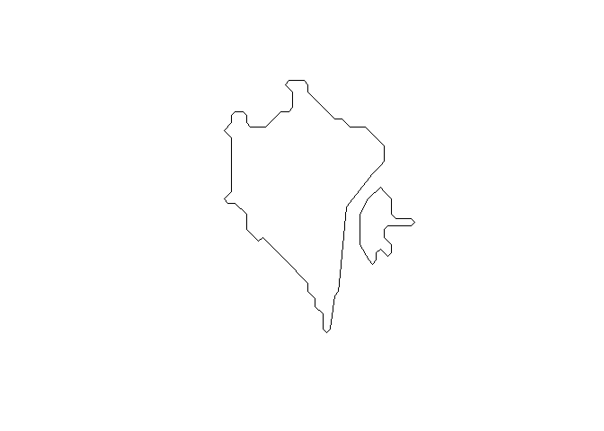

<!-- README.md is generated from README.Rmd. Please edit that file -->

# traveltimeSF

<!-- badges: start -->

[](https://lifecycle.r-lib.org/articles/stages.html#experimental)
[](https://CRAN.R-project.org/package=traveltimeSF)
[](https://github.com/arthurgailes/traveltimeSF/actions)
<!-- badges: end -->

The goal of traveltimeSF is to provide simple wrappers for converting
data from the TravelTime SDK for R to sf. Currently only works with
isochrones

## Installation

You can install the development version from GitHub with:

``` r
# install.packages("devtools")
devtools::install_github("arthurgailes/traveltimeSF")
```

## Example

Adapted from the [TravelTime
Github](https://github.com/traveltime-dev/traveltime-sdk-r):

``` r
library(traveltimeR)

#store your credentials in an environment variable
# Sys.setenv(TRAVELTIME_ID = "YOUR_API_ID")
# Sys.setenv(TRAVELTIME_KEY = "YOUR_API_KEY")

library(traveltimeSF)
departure_search <-
  make_search(id = "public transport from Trafalgar Square",
              departure_time = strftime(as.POSIXlt(Sys.time(), "UTC"), "%Y-%m-%dT%H:%M:%SZ"),
              travel_time = 900,
              coords = list(lat = 51.507609, lng = -0.128315),
              transportation = list(type = "public_transport"),
              properties = list('is_only_walking'))

result <- time_map(departure_searches = departure_search)

shp <- time_map_to_sf(result)
shp
#> Simple feature collection with 1 feature and 2 fields
#> Geometry type: MULTIPOLYGON
#> Dimension:     XY
#> Bounding box:  xmin: -0.145391 ymin: 51.49046 xmax: -0.1094006 ymax: 51.52013
#> CRS:           +proj=longlat +datum=WGS84
#>                                search_id is_only_walking
#> 1 public transport from Trafalgar Square           FALSE
#>                         geometry
#> 1 MULTIPOLYGON (((-0.1453906 ...
```

``` r
plot(shp$geometry)
```



The same function can also work with multiple searches:

``` r
departure_search1 <-
  make_search(id = "public transport from Trafalgar Square",
    departure_time = "2022-01-01T08:00:00Z",
    travel_time = 900,
    coords = list(lat = 51.507609, lng = -0.128315),
    transportation = list(type = "public_transport"),
    properties = list('is_only_walking'))

departure_search2 <-
  make_search(id = "driving from Trafalgar Square",
    departure_time = "2022-01-01T08:00:00Z",
    travel_time = 900,
    coords = list(lat = 51.507609, lng = -0.128315),
    transportation = list(type = "driving"))

arrival_search <-
  make_search(id = "public transport to Trafalgar Square",
    arrival_time = "2022-01-01T08:00:00Z",
    travel_time = 900,
    coords = list(lat = 51.507609, lng = -0.128315),
    transportation = list(type = "public_transport"),
    range = list(enabled = T, width = 3600))

union <- make_union_intersect(id = "union of driving and public transport",
  search_ids = list('driving from Trafalgar Square',
    'public transport from Trafalgar Square'))
intersection <- make_union_intersect(id = "intersection of driving and public transport",
  search_ids = list('driving from Trafalgar Square',
    'public transport from Trafalgar Square'))

multi_search <-
  time_map(
    departure_searches = c(departure_search1, departure_search2),
    arrival_searches = arrival_search,
    unions = union,
    intersections = intersection
  )

time_map_to_sf(multi_search)
#> Simple feature collection with 5 features and 2 fields
#> Geometry type: MULTIPOLYGON
#> Dimension:     XY
#> Bounding box:  xmin: -0.1698701 ymin: 51.48415 xmax: -0.08924938 ymax: 51.5255
#> CRS:           +proj=longlat +datum=WGS84
#>                                      search_id is_only_walking
#> 1                driving from Trafalgar Square              NA
#> 2 intersection of driving and public transport              NA
#> 3       public transport from Trafalgar Square            TRUE
#> 4         public transport to Trafalgar Square              NA
#> 5        union of driving and public transport              NA
#>                         geometry
#> 1 MULTIPOLYGON (((-0.1669901 ...
#> 2 MULTIPOLYGON (((-0.1191356 ...
#> 3 MULTIPOLYGON (((-0.1396858 ...
#> 4 MULTIPOLYGON (((-0.1396858 ...
#> 5 MULTIPOLYGON (((-0.1669901 ...
```
